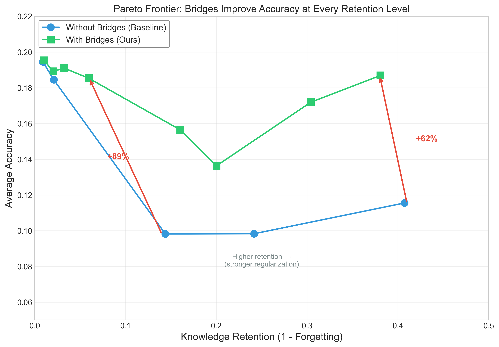
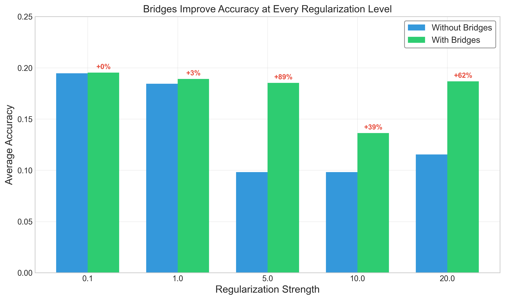
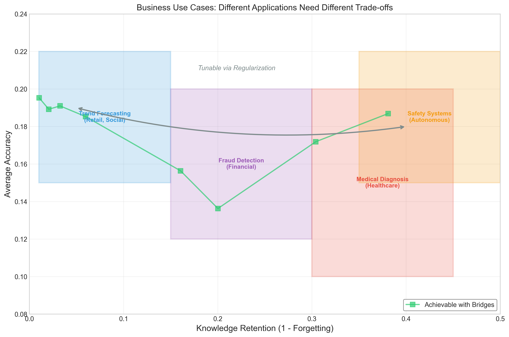

# Collaborative Nested Learning

> Multi-timescale optimization with bidirectional knowledge bridges for continual learning

[](LICENSE)
[](https://www.python.org/downloads/)
[](https://pytorch.org/)

Implementation of Google's [Nested Learning](https://abehrouz.github.io/files/NL.pdf) (NeurIPS 2025) with a **novel extension**: bidirectional knowledge bridges that enable explicit cross-timescale learning.

## The Problem: Catastrophic Forgetting

Deep learning models suffer from **catastrophic forgetting**: when learning new tasks, they lose performance on previously learned tasks. This is a fundamental limitation for deploying ML systems that need to continuously learn.

## Our Solution: Knowledge Bridges

We extend Google's Nested Learning approach with **bidirectional knowledge bridges** that enable memory banks at different timescales to teach each other:

- **Fast → Slow**: When fast memory discovers consistent patterns, it shares them with slower banks
- **Slow → Fast**: When slow memory has consolidated knowledge, it guides fast memory's exploration



**Key Result**: Bridges shift the accuracy-forgetting Pareto frontier, achieving **62% higher accuracy** at the same retention level compared to the baseline.

## Key Features

- 🧠 **Multi-timescale optimization** - Fast, medium, and slow memory banks updating at different frequencies
- 🌉 **Knowledge bridges** - Bidirectional transfer between timescales (our novel contribution)
- ⚙️ **Tunable trade-off** - Single hyperparameter controls accuracy vs. retention balance
- 📊 **Reproducible experiments** - All results with JSON outputs and visualization scripts

## Results

### Split-MNIST Continual Learning (5 sequential tasks)

| Method | Avg Accuracy | Forgetting | Retention |
|--------|-------------|------------|-----------|
| SGD Baseline | 19.4% | 99.1% | 0.9% |
| CMS (reg=5.0) | 9.8% | 85.6% | 14.4% |
| **CMS + Bridges (reg=5.0)** | **18.5%** | 94.0% | 6.0% |
| CMS (reg=20.0) | 11.5% | 59.3% | 40.7% |
| **CMS + Bridges (reg=20.0)** | **18.7%** | 61.9% | 38.1% |

**Key Insight**: Bridges consistently improve accuracy at every regularization level. The trade-off between accuracy and retention is tunable via the regularization strength.



### Understanding the Trade-off

Different applications need different trade-offs:



- **High adaptation** (low reg): Best for rapidly changing domains (trends, new fraud patterns)
- **High retention** (high reg): Best for safety-critical systems (medical, autonomous)
- **Balanced**: Best for most production systems

## Installation

```bash
# Clone the repository
git clone https://github.com/jstiltner/collaborative-nested-learning
cd collaborative-nested-learning

# Create virtual environment
python -m venv .venv
source .venv/bin/activate  # On Windows: .venv\Scripts\activate

# Install dependencies
pip install -r requirements.txt

# Install in development mode
pip install -e .
```

## Quick Start

```python
import torch
from src.optimizers.collaborative_cms import CollaborativeCMSOptimizer

# Your model
model = torch.nn.Sequential(
    torch.nn.Linear(784, 256),
    torch.nn.ReLU(),
    torch.nn.Linear(256, 10)
)

# Create optimizer with knowledge bridges
optimizer = CollaborativeCMSOptimizer(
    model.parameters(),
    lr=0.01,
    hidden_dim=64,
    regularization_strength=5.0,  # Tune this for your use case
    enable_bridges=True
)

# Training loop
for batch in dataloader:
    loss = criterion(model(batch.x), batch.y)
    optimizer.zero_grad()
    loss.backward()
    optimizer.step()
```

## Running Experiments

### Reproduce Our Results

```bash
# Run the main ablation study
python benchmarks/run_ablation.py

# Run bridge ablation (with vs without bridges)
python benchmarks/run_bridge_ablation.py

# Run regularization sweep
python benchmarks/run_reg_sweep.py

# Generate visualizations
python experiments/visualize_contribution.py
```

### View Results

Results are saved to `experiments/results/` as JSON files. Run the analysis script:

```bash
python experiments/results_analysis.py
```

## Architecture

```
┌─────────────────────────────────────────────────┐
│              Input Gradient                      │
└──────────────┬──────────────────────────────────┘
               │
       ┌───────▼──────┐
       │ Fast Memory  │ ◄──┐ Updates every step
       │              │    │
       └───────┬──────┘    │
               │           │ Bidirectional
        Bridge ↕           │ Knowledge
               │           │ Transfer
       ┌───────▼──────┐    │
       │Medium Memory │ ◄──┤ Updates every 10 steps
       │              │    │
       └───────┬──────┘    │
               │           │
        Bridge ↕           │
               │           │
       ┌───────▼──────┐    │
       │ Slow Memory  │ ◄──┘ Updates every 50 steps
       │              │
       └───────┬──────┘
               │
               ▼
        Parameter Update
```

**Novel contribution**: The bridges enable bidirectional knowledge flow with learned gating that determines when and how much to transfer.

## Project Structure

```
collaborative-nested-learning/
├── src/
│   ├── optimizers/          # Optimizer implementations
│   │   ├── deep_momentum.py # Learned momentum optimizer
│   │   ├── nested_optimizer.py  # Multi-timescale optimizer
│   │   └── collaborative_cms.py # Full implementation with bridges
│   ├── bridges/             # Knowledge bridge mechanisms
│   │   └── knowledge_bridges.py
│   └── memory/              # Memory bank implementations
│       ├── memory_bank.py
│       └── continuum.py     # Continuum Memory System
├── benchmarks/              # Benchmark scripts
│   ├── split_mnist.py       # Split-MNIST dataset
│   ├── metrics.py           # Evaluation metrics
│   └── run_*.py             # Various ablation studies
├── experiments/             # Analysis and visualization
│   ├── results/             # JSON result files
│   ├── results_analysis.py  # Analysis script
│   └── visualize_contribution.py
├── figures/                 # Generated visualizations
├── tests/                   # Unit tests
└── docs/                    # Documentation
```

## Citation

If you use this work, please cite:

```bibtex
@software{stiltner2025collaborative,
  author = {Stiltner, Jason},
  title = {Collaborative Nested Learning: Bidirectional Knowledge Bridges for Continual Learning},
  year = {2025},
  url = {https://github.com/jstiltner/collaborative-nested-learning}
}
```

And the original Nested Learning paper:

```bibtex
@inproceedings{behrouz2025nested,
  title={Nested Learning},
  author={Behrouz, Ali and Razaviyayn, Meisam and Zhong, Peilin and Mirrokni, Vahab},
  booktitle={NeurIPS},
  year={2025}
}
```

## Contributing

Contributions welcome! Please see [CONTRIBUTING.md](CONTRIBUTING.md) for guidelines.

Areas for contribution:
- Additional benchmarks (CIFAR-100, language modeling)
- Adaptive bridge topology
- Integration with PyTorch Lightning / HuggingFace
- Performance optimizations

## Development

```bash
# Install dev dependencies
pip install -r requirements.txt

# Run tests
pytest tests/

# Format code
black src/ tests/ benchmarks/
isort src/ tests/ benchmarks/
```

## License

This project is open source under the [Apache 2.0 License](LICENSE).

See [LICENSING.md](LICENSING.md) for commercial use details.

## Related Work

- [Nested Learning (NeurIPS 2025)](https://abehrouz.github.io/files/NL.pdf) - Original paper
- [Titans](https://arxiv.org/abs/2501.00663) - Precursor architecture
- [Elastic Weight Consolidation](https://arxiv.org/abs/1612.00796) - Alternative approach

## Author

**Jason Stiltner**
- Website: [jasonstiltner.com](https://jasonstiltner.com)
- LinkedIn: [jason-stiltner](https://linkedin.com/in/jasonlstiltner)

ML Engineer with experience deploying production systems across 190 hospitals. Interested in continual learning and self-improving systems.

---

**Status**: 🚧 Active Development | 📊 Benchmarked | 📖 Documented
